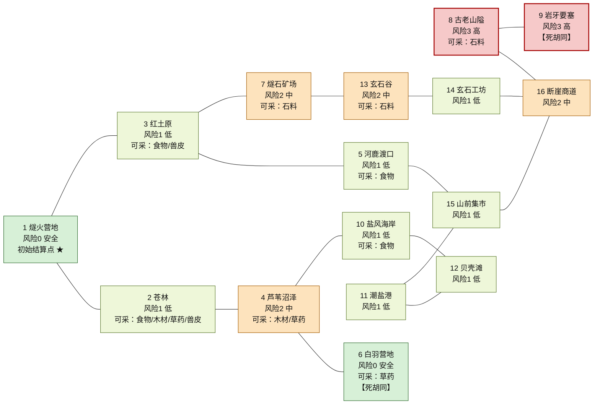
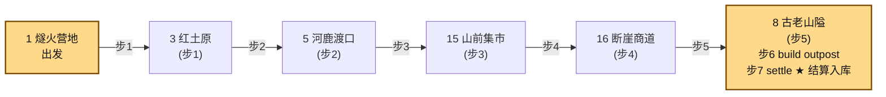

# 十六地点地图与完整试玩路线（Mermaid）

> 生成方式：`./out/<构建目录>/tribe-map-playthrough --mermaid > artifacts/map-diagrams.md`
> 图 1 的地点、道路与风险颜色读取自 `world_map_catalog`；图 2、图 3 的移动序列读取自 `delivery_route.hpp`。
> 因此**图示与代码同源**：地图或路线一旦被改坏（例如此处移动到不相邻地点），生成即失败并返回非 0。

## 图 1：十六地点道路总览

### 道路总览（16 地点 / 17 条双向道路）

> 地点 16 个、双向道路 17 条，全部读取自 `world_map::locations()`；颜色为风险等级。

## 图 2：第一段完整试玩路线（木材采集，29 步）

### 营地 → 苍林 → 芦苇沼泽 → 白羽营地(往返) → 盐风海岸 → 贝壳滩 → 潮盐港 → 山前集市 → 河鹿渡口 → 红土原 → 燧石矿场 → 玄石谷 → 玄石工坊 → 断崖商道 → 古老山隘 → 岩牙要塞 → 返程 → 营地结算

```mermaid
flowchart LR
    P1["1 燧火营地<br/>出发"]
    P2["2 苍林<br/>(步1)<br/>步2 gather wood<br/>步3 gather wood"]
    P3["4 芦苇沼泽<br/>(步4)"]
    P4["6 白羽营地<br/>(步5)"]
    P5["4 芦苇沼泽<br/>(步6)"]
    P6["10 盐风海岸<br/>(步7)"]
    P7["12 贝壳滩<br/>(步8)"]
    P8["11 潮盐港<br/>(步9)"]
    P9["15 山前集市<br/>(步10)"]
    P10["5 河鹿渡口<br/>(步11)"]
    P11["3 红土原<br/>(步12)"]
    P12["7 燧石矿场<br/>(步13)"]
    P13["13 玄石谷<br/>(步14)"]
    P14["14 玄石工坊<br/>(步15)"]
    P15["16 断崖商道<br/>(步16)"]
    P16["8 古老山隘<br/>(步17)"]
    P17["9 岩牙要塞<br/>(步18)<br/>步19 attack"]
    P18["8 古老山隘<br/>(步20 retreat 撤退)"]
    P19["9 岩牙要塞<br/>(步21)<br/>步22 attack ×n（直至击退）"]
    P20["8 古老山隘<br/>(步23)"]
    P21["16 断崖商道<br/>(步24)"]
    P22["15 山前集市<br/>(步25)"]
    P23["5 河鹿渡口<br/>(步26)"]
    P24["3 红土原<br/>(步27)"]
    P25["1 燧火营地<br/>(步28)<br/>步29 settle ★ 结算入库"]
    P1 -->|"步1"| P2
    P2 -->|"步4"| P3
    P3 -->|"步5"| P4
    P4 -->|"步6"| P5
    P5 -->|"步7"| P6
    P6 -->|"步8"| P7
    P7 -->|"步9"| P8
    P8 -->|"步10"| P9
    P9 -->|"步11"| P10
    P10 -->|"步12"| P11
    P11 -->|"步13"| P12
    P12 -->|"步14"| P13
    P13 -->|"步15"| P14
    P14 -->|"步16"| P15
    P15 -->|"步17"| P16
    P16 -->|"步18"| P17
    P17 -->|"步20 retreat 撤退"| P18
    P18 -->|"步21"| P19
    P19 -->|"步23"| P20
    P20 -->|"步24"| P21
    P21 -->|"步25"| P22
    P22 -->|"步26"| P23
    P23 -->|"步27"| P24
    P24 -->|"步28"| P25
    class P1,P25 terminus
    classDef terminus fill:#ffd98a,stroke:#7a4a00,stroke-width:2px,color:#111111
```

## 图 3：第二段完整试玩路线（前哨建设，7 步）

### 营地 → 红土原 → 河鹿渡口 → 山前集市 → 断崖商道 → 古老山隘（建前哨并结算）

## 图例

| 记号 | 含义 |
| --- | --- |
| 节点底色 | 风险等级：绿 = 0 安全、浅绿 = 1 低、橙 = 2 中、红 = 3 高 |
| `可采：…` | 该地点允许采集的资源（`world_map::supportsResource` 的唯一分布） |
| `初始结算点 ★` | 开局唯一可 `settle` 的地点；任意地点建成前哨后也成为结算点 |
| `【死胡同】` | 只有一个邻接地点，进入后必须原路返回（白羽营地、岩牙要塞） |
| 拓扑图连线 `---` | 双向可通行的道路 |
| 路线图箭头上的 `步N` | 命令表中的第 N 步，与 `docs/02` 第 5 节、`artifacts/route-tables.md` 的序号一致（`attack ×n` 表示重复直到击退） |
| 路线图金色节点 | 起点与终点（两段都以结算收尾） |
