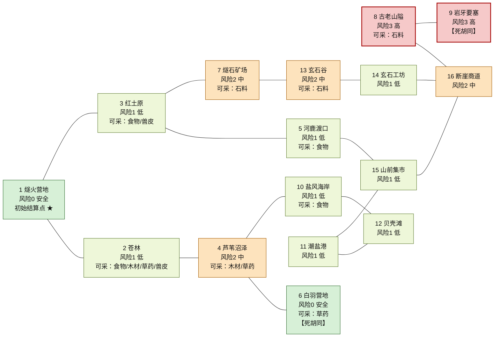

# 十六地点地图与完整试玩路线

> 交付人：成员3（地图任务与小队系统）
> 代码依据：`formal/src/world_map_catalog.cpp`（唯一地图目录）、`formal/include/tribe/game_state.hpp`（`WorldLocationId` 稳定编号）、`formal/src/expansion_game.cpp`（任务层）
> 路线数据：`deliverables/member3-map-mission/tools/delivery_route.hpp`（文档、测试、试玩工具共用的唯一路线表）
> 实测实录：`artifacts/playthrough-transcript.txt`（真实引擎执行，45 条命令全部成功）

---

## 1. 地图总览

地图是**十六地点的无向道路图**，编号 1 至 16 与 `WorldLocationId` 的持久化枚举顺序一一对应（`formal/include/tribe/game_state.hpp:40`）。编号一旦改变，所有存档里的 `worldLocation` 都会错位，因此编号是**不可调整的对外契约**。

| 编号 | 地点 | 职能 | 邻接地点（编号） | 距营地步数 |
| --- | --- | --- | --- | --- |
| 1 | 燧火营地 | 营地：管理、建设、唯一初始结算点 | 2、3 | 0 |
| 2 | 苍林 | 资源：食物、木材、草药、兽皮（五项占其四） | 1、4 | 1 |
| 3 | 红土原 | 资源：食物、兽皮 | 1、5、7 | 1 |
| 4 | 芦苇沼泽 | 资源：木材、草药 | 2、6、10 | 2 |
| 5 | 河鹿渡口 | 外交：河鹿部落接触点；食物采集 | 3、15 | 2 |
| 6 | 白羽营地 | 外交：白羽部落接触点；草药采集 | 4 | 3 |
| 7 | 燧石矿场 | 资源：石料 | 3、13 | 2 |
| 8 | 古老山隘 | 路线：岩牙部落接触点；石料采集 | 9、16 | 5 |
| 9 | 岩牙要塞 | 战争：岩牙巡逻遭遇与征服目标 | 8 | 6 |
| 10 | 盐风海岸 | 资源：食物（远程采集） | 4、12 | 3 |
| 11 | 潮盐港 | 外交：潮盐部落接触点 | 12、15 | 4 |
| 12 | 贝壳滩 | 路线：纯通道 | 10、11 | 4 |
| 13 | 玄石谷 | 资源：石料 | 7、14 | 3 |
| 14 | 玄石工坊 | 外交：玄石部落接触点 | 13、16 | 4 |
| 15 | 山前集市 | 路线：三路交汇的交通节点 | 5、11、16 | 3 |
| 16 | 断崖商道 | 路线：商路 | 14、15、8 | 4 |

- 邻接关系是**严格双向**的：`world_map::adjacent(a, b)` 与 `adjacent(b, a)` 必须同时成立（`formal/tests/map_mission_tests.cpp:66` 已覆盖）。
- 全图共 **17 条道路**、**唯一最远点**：岩牙要塞距营地 6 步。
- 唯一性：所有路径都由 `world_map::roadPath` 以广度优先算法推导，并列时取编号更小的地点，因此同一条最短路在任何机器上都可复现（新交付测试逐对校验了 16×16 全部组合）。

### 1.1 Mermaid 地图（图示与代码同源）

下面这张图不是手画的：节点、道路、风险颜色全部由 `world_map::locations()` 与 `world_map::profile()` 直接生成
（`./out/<构建目录>/tribe-map-playthrough --mermaid > artifacts/map-diagrams.md`，
配置时需加 `-DTRIBE_BUILD_DELIVERY_TOOLS=ON`），
因此它与代码**不可能不一致**——地图被改坏时（例如出现不存在的道路）生成会直接失败。
完整图示文件（含两段路线图与图例）见 `artifacts/map-diagrams.md`。



> 底色 = 风险等级（绿 0 安全 / 浅绿 1 低 / 橙 2 中 / 红 3 高）；`---` = 双向道路；`★` = 初始结算点；`【死胡同】` = 只有一个邻接地点。

## 2. 地图结构：一个主环 + 一条东线捷径 + 两条死胡同

图例：`A ─(n)─ B` 表示“在 A 输入 `move n` 可以到达 B”，括号里的数字就是目标地点的编号（与表格第 1 节一致）。17 条道路可以完整拆成下面三部分。

**主环（9 个地点、9 条边，可以一路不回头地绕回营地；分成两行书写，`12 贝壳滩` 是两行的接点）**

```
1 营地 ─(2)─ 2 苍林 ─(4)─ 4 芦苇沼泽 ─(10)─ 10 盐风海岸 ─(12)─ 12 贝壳滩
12 贝壳滩 ─(11)─ 11 潮盐港 ─(15)─ 15 山前集市 ─(5)─ 5 河鹿渡口 ─(3)─ 3 红土原 ─(1)─ 1 营地
```

**东线捷径（5 条边，把主环的东段截弯取直，是石料与外交的快速通道）**

```
3 红土原 ─(7)─ 7 燧石矿场 ─(13)─ 13 玄石谷 ─(14)─ 14 玄石工坊 ─(16)─ 16 断崖商道 ─(15)─ 15 山前集市
```

**两条死胡同（3 条边，进入后必须原路返回）**

```
4 芦苇沼泽 ─(6)─ 6 白羽营地        （白羽营地度数 1：只连芦苇沼泽）
16 断崖商道 ─(8)─ 8 古老山隘 ─(9)─ 9 岩牙要塞   （岩牙要塞度数 1：只连古老山隘）
```

读图要点（这三条决定了“会不会迷路”）：

1. **主环**给玩家一条“永不回头”的安全路线；返程若不想原路走，可以换环的另一半。
2. **东线捷径**与主环的 `红土原—河鹿渡口—山前集市` 走廊合起来构成第二个环，所以地图上一共有两个独立环（边数 17、点数 16，环数 = 17 − 16 + 1 = 2）。
3. **两条死胡同**（白羽营地、岩牙要塞）是新手最容易浪费里程与疲劳的地方；`岩牙要塞` 也是撤退规则的落点来源（撤退固定回古老山隘）。

## 3. 终端版式图与“真实道路”的区别（重要）

游戏内 `[ 道路总览 ]` 页面用的是一张**版式图**（`world_map::roadRows()`，`formal/src/world_map_catalog.cpp`），它只画同一行相邻节点的连线，用于给玩家方位感：

```
                         [8 古老山隘] ── [9 岩牙要塞]

  [6 白羽] ── [4 芦苇] ── [10 盐风] ── [12 贝壳] ── [11 潮盐]

      [2 苍林] ── [1 营地]★ ── [3 红土] ── [5 河鹿] ── [15 山前] ── [16 断崖]

                         [7 矿场] ── [13 玄石谷] ── [14 玄石工坊]
```

**版式图不是完整连线图**：它只在“同一行内相邻节点”之间画连线，因此 17 条真实道路只画出 12 条，**没有画出**的 5 条是：

| 未画出的真实道路 | 示意图上的位置关系 |
| --- | --- |
| 苍林 ↔ 芦苇沼泽 | 分属两行（苍林在第 3 行、芦苇沼泽在第 2 行） |
| 红土原 ↔ 燧石矿场 | 分属两行（红土原在第 3 行、燧石矿场在第 4 行） |
| 潮盐港 ↔ 山前集市 | 分属两行（潮盐港在第 2 行、山前集市在第 3 行） |
| 玄石工坊 ↔ 断崖商道 | 分属两行（玄石工坊在第 4 行、断崖商道在第 3 行） |
| 古老山隘 ↔ 断崖商道 | 分属两行（古老山隘在第 1 行、断崖商道在第 3 行） |

已画出的 12 条连线都是真实道路（没有“画了却不存在”的假线），但**少画了 5 条**，玩家很容易把“没画线”误读成“不能走”。真实道路一律以本文第 1 节的邻接表与游戏内 `look/查看` 的“相邻道路”一行为准。这一差异是 5.2 “增加地图路线提示，减少玩家迷路”要解决的核心问题，处理方式见 `04-优化与改动说明.md`。

## 4. 地点档案：风险、收益与现场危险

每个地点都有一份只读档案（`world_map::LocationProfile`，新增交付），在 `look/查看` 与地图页上展示：

| 风险 | 地点 | 说明 |
| --- | --- | --- |
| 0 安全 | 1 燧火营地、6 白羽营地 | 营地是绝对安全区；白羽营地是友邦营地 |
| 1 低 | 2 苍林、3 红土原、5 河鹿渡口、10 盐风海岸、11 潮盐港、12 贝壳滩、14 玄石工坊、15 山前集市 | 无战斗威胁，主要成本是里程与疲劳；贝壳滩涨潮封路，走错要原路返回 |
| 2 中 | 4 芦苇沼泽、7 燧石矿场、13 玄石谷、16 断崖商道 | 地形与落石风险；沼泽行军疲劳更重，矿场石料沉重易占满载货 |
| 3 高 | 8 古老山隘、9 岩牙要塞 | 古老山隘是岩牙部落接触点（交涉或劫掠入口）；要塞有敌对巡逻，未击退不能建前哨 |

> 风险等级是**展示层信息**：它不改变任何数值规则，也不写入存档。这样既能拉开十六地点的探索差异，又不会破坏既有平衡与 v6 存档兼容。若要让它产生机制效果（例如按风险决定遭遇表），见第 8 节的扩展点。

## 5. 完整试玩路线

路线分两段，**共 2 次任务、2 点行动点**，在一个季节内即可走完，覆盖十六地点、一次遭遇战、一次前哨建设与两种结算方式。

### 5.1 出发前的前置条件（经营阶段）

| 命令 | 作用 | 校验规则 |
| --- | --- | --- |
| `assign wood 2` | 木材队 2 人 | 采集任务的劳力与载货容量都由该队人数决定 |
| `assign stone 2` | 石料队 2 人 | 前哨建设任务要求木材队与石料队各至少 2 人 |

### 5.2 第一段：木材采集任务（`mission wood`）

<!-- 由 tribe-map-playthrough --route-markdown 生成（`artifacts/route-tables.md`），请勿手改 -->

| 序号 | 命令 | 该步验证的规则 |
| --- | --- | --- |
| 1 | `move 2` | 燧火营地→苍林：先在手边采集，避免全程空跑 |
| 2 | `gather wood` | 采集木材（采集时段1/4） |
| 3 | `gather wood` | 采集木材（采集时段2/4），此后留出时段以备返程 |
| 4 | `move 4` | 苍林→芦苇沼泽（风险2级：木材与草药） |
| 5 | `move 6` | 芦苇沼泽→白羽营地（风险0级：草药与外交） |
| 6 | `move 4` | 白羽营地→芦苇沼泽：支线必须原路返回，这是最容易迷路的一段 |
| 7 | `move 10` | 芦苇沼泽→盐风海岸 |
| 8 | `move 12` | 盐风海岸→贝壳滩（纯通道，涨潮封路） |
| 9 | `move 11` | 贝壳滩→潮盐港 |
| 10 | `move 15` | 潮盐港→山前集市（三路交汇的交通节点） |
| 11 | `move 5` | 山前集市→河鹿渡口 |
| 12 | `move 3` | 河鹿渡口→红土原 |
| 13 | `move 7` | 红土原→燧石矿场 |
| 14 | `move 13` | 燧石矿场→玄石谷 |
| 15 | `move 14` | 玄石谷→玄石工坊 |
| 16 | `move 16` | 玄石工坊→断崖商道 |
| 17 | `move 8` | 断崖商道→古老山隘（岩牙部落接触点） |
| 18 | `move 9` | 古老山隘→岩牙要塞（风险3级：敌对巡逻） |
| 19 | `attack` | 第一次攻击巡逻：遭遇未结束期间道路被封锁，不能移动或采集 |
| 20 | `retreat` | 撤退固定退回古老山隘，演示撤退落点稳定、不会把小队丢到随机地点 |
| 21 | `move 9` | 再次进入要塞，准备彻底击退巡逻 |
| 22 | `attack`（重复至击退，上限 10 次） | 反复 attack 击退岩牙巡逻，获得岩牙巡逻徽记（饰品，意志+1） |
| 23 | `move 8` | 要塞→古老山隘：击退后道路恢复通行 |
| 24 | `move 16` | 古老山隘→断崖商道（开始返程） |
| 25 | `move 15` | 断崖商道→山前集市 |
| 26 | `move 5` | 山前集市→河鹿渡口 |
| 27 | `move 3` | 河鹿渡口→红土原 |
| 28 | `move 1` | 红土原→燧火营地：十六地点至此全部发现 |
| 29 | `settle` | 在营地结算：载货与任务背包在此时才写入部落仓库 |

### 5.3 第二段：前哨建设任务（`mission outpost`）

| 序号 | 命令 | 该步验证的规则 |
| --- | --- | --- |
| 1 | `move 3` | 燧火营地→红土原：随队携带木材6、石料4，不能再采集 |
| 2 | `move 5` | 红土原→河鹿渡口 |
| 3 | `move 15` | 河鹿渡口→山前集市 |
| 4 | `move 16` | 山前集市→断崖商道 |
| 5 | `move 8` | 断崖商道→古老山隘：选这里当前哨，作为进攻岩牙要塞的前进基地 |
| 6 | `build outpost` | 建造前哨：现场消耗木材6、石料4，此处变成结算点 |
| 7 | `settle` | 在前哨结算：验证“营地以外也能入库”的第二条合法结算路径 |

### 5.4 路线设计取舍

| 取舍 | 说明 |
| --- | --- |
| 返程走主环走廊（4 步）而不是东线捷径（6 步） | 从断崖商道回营：`断崖→山前→河鹿→红土→营地` 是 4 步；走 `断崖→玄石工坊→玄石谷→矿场→红土→营地` 是 6 步。里程直接等于疲劳，因此选短的一条。 |
| 先采集再远行 | 苍林就在营地旁边，先装满 2 次采集（12 单位）再出发，避免返程时采集时段不够。 |
| 采集只做 2/4 次 | 留出时段余量；同时也避免 24 点载货上限被填满后被迫中断路线。 |
| 前哨选古老山隘 | 它是岩牙要塞唯一的前进基地与撤退落点，同时是岩牙部落接触点，兼有外交价值。 |
| 遭遇分两次打 | 先打一次再撤退（演示撤退规则），再重新进入彻底击退（拿到徽记并解锁在要塞建前哨）。 |

### 5.5 Mermaid 路线图（由路线表直接生成）

两张图由 `delivery_route.hpp` 的同一份路线表生成：箭头上的“步N”与上面两节的命令表序号一一对应，
`attack ×n` 表示重复攻击直到击退。若路线表里出现不相邻的移动，生成会失败并返回非 0，因此图不可能与规则矛盾。

**第一段：木材采集任务（29 步，24 次移动）**


**第二段：前哨建设任务（7 步，5 次移动）**


> 金色节点 = 起点与终点；两段路线都以 `settle` 收尾，因此载货都只在最后一步入库。

## 6. 实测结果（真实引擎）

实录文件：`artifacts/playthrough-transcript.txt`（由 `tribe-map-playthrough` 生成，退出码 0）。

| 指标 | 实测值 |
| --- | --- |
| 命令总数 / 失败数 | 45 / 0 |
| 任务完成次数 | 2（采集 1 次 + 前哨建设 1 次） |
| 已发现地点 | 16/16 |
| 前哨 | 1（古老山隘，不含营地） |
| 行动点 | 3 → 1（两次任务各消耗 1 点；地图内的移动与采集不再消耗季节行动点） |
| 第一段任务回合数 | 32 回合（含 22 次移动、2 次采集、6 次战斗、1 次撤退、1 次结算） |
| 第二段任务回合数 | 7 回合（5 次移动 + 1 次建造 + 1 次结算；建造完成时任务回合为 6，结算推进到 7） |
| 木材 | 12 → 24（+12 采集入库）→ 18（前哨建设带走 6） |
| 石料 | 4 → 0（前哨建设带走 4） |
| 战利品 | 岩牙巡逻徽记（饰品，意志 +1）已随结算并入部落仓库 |
| 长期小队 | 晨火队 4 人，疲劳 61，精锐经验 30，驻地由燧火营地更新为古老山隘 |

关键回执（原文摘录）：

```
[37] > settle
    ✓ 小队在燧火营地结算。 地图任务载货及任务背包已并入部落库存，小队驻地已更新。
    [季节1 行动点2 阶段0 食物20 木材24 石料4 草药3 兽皮0]

[44] > build outpost
    ✓ 小队建成前哨；这里现在可作为结算点。
    [季节1 行动点1 阶段1 食物20 木材18 石料0 草药3 兽皮0 | 任务回合6 位置8 载货0/24 采集0/4]

[45] > settle
    ✓ 小队在前哨结算并驻留。 地图任务载货及任务背包已并入部落库存，小队驻地已更新。
```

**结论**：地图任务具备两条合法结算路径（营地、自建前哨），载货只在结算时入账；一次任务可在一季内走遍全部十六地点并完成遭遇、建造与结算。

## 7. 常见迷路点与正确走法

| 迷路点 | 玩家常犯的错 | 正确走法 | 测试覆盖 |
| --- | --- | --- | --- |
| 苍林 | 从红土原/矿场直接去苍林 | 苍林只连营地与芦苇沼泽；从燧石矿场去苍林要 3 步：矿场→红土原→营地→苍林 | 交付测试「路线提示…」第 3 组 |
| 白羽营地 | 以为能继续往北走 | 死胡同：必须原路回到芦苇沼泽 | 交付路线表静态校验 |
| 贝壳滩 | 以为可以直接去山前集市 | 只连盐风海岸与潮盐港，绕行要原路返回 | 交付路线表静态校验 |
| 岩牙要塞 | 遭遇中想“先跑再说”或撤退后被传送到随机地点 | 遭遇期间道路封锁，只能 attack/defend/retreat/look；撤退**固定**回古老山隘 | 交付测试「岩牙要塞遭遇…」 |
| 山前集市 | 分不清三条路各自通向哪里 | 三路分别是河鹿渡口（西）、潮盐港（东）、断崖商道（东偏北）；`look/查看` 会列出全部相邻地点 | 交付测试「十六地点道路图…」 |
| 采集错地点 | 在不产指定资源的地点反复 `gather` | `look/查看` 会提示“此地不产 + 最近产地 + 几步 + 该输入哪条 move” | 交付测试「路线提示…」第 3 组 |

## 8. 后续扩展点（留给后续接手者）

1. **让风险等级产生机制效果**：目前 `LocationProfile` 只做展示。若要按风险决定遭遇率或疲劳倍率，建议在 `ExpansionGame::recordTurn` 里按 `world_map::profile(current).risk` 调整疲劳增量——注意这会影响所有既有里程测试，需要同步更新本文与 `05-测试说明与验收矩阵.md`。
2. **版式图连线**：`world_map::roadRows()` 的行内连线并不能表达全部道路。若要让版式图成为完整连线图，需要重画 `roadRows()` 的列布局，并同步 `formal/tests/map_mission_tests.cpp` 中“每个地点恰好出现一次”的断言。
3. **多小队并行**：`ExpansionState` 目前只有一支小队；扩展为多支需要新增持久化字段，**必须同时升级 `kSaveVersion` 与 `save_codec.cpp` 的定长字段顺序**，否则会破坏 v6 存档。
4. **地图编辑器/校验器**：可直接复用 `world_map::roadDistance`、`roadPath` 与交付测试里的拓扑断言，对新的地图目录做连通性、双向性与最短路回归检查。
