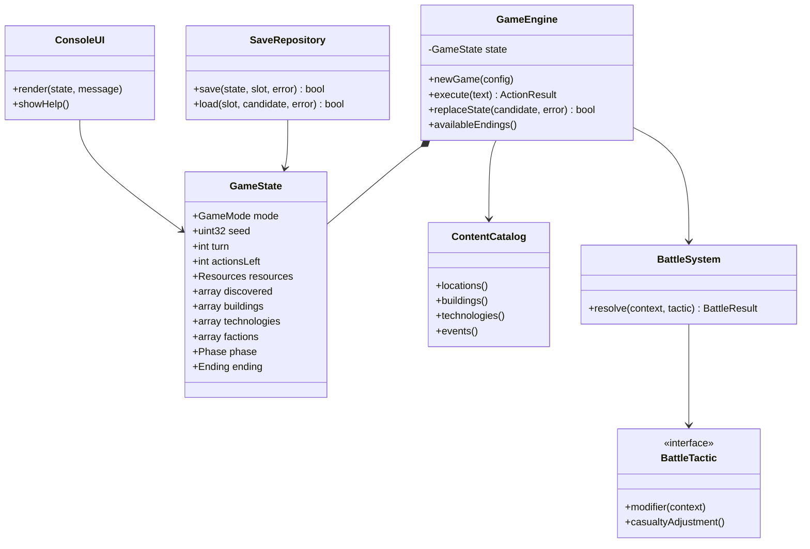
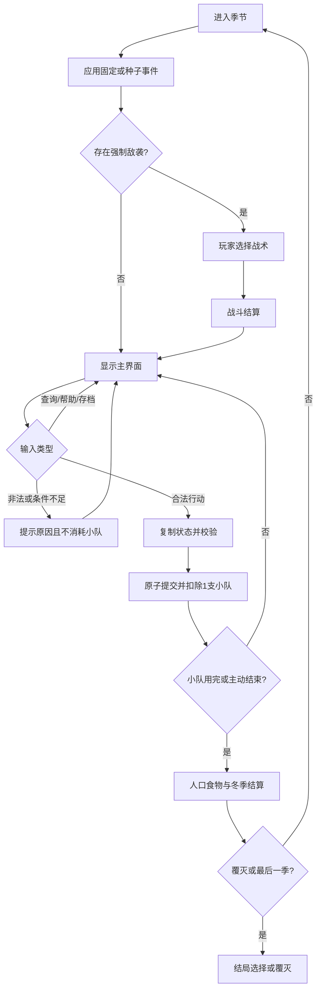

# 《燧火纪：部落黎明》系统设计

## 1. 设计原则

- `GameState` 是唯一可变的游戏事实；界面不直接改数值。
- `GameEngine` 先复制状态、检查规则，再一次性提交，避免失败命令改一半。
- 地点、建筑、技术和事件放在只读数据表中，规则代码不重复写名称和价格。
- 存档模块只负责持久化，界面模块只负责显示，战斗模块只负责战力与伤亡。

## 2. UML 类图

## 3. 核心流程

## 4. 数据与规则

### 4.1 地图连接

- 燧火营地连接苍林、红土原。
- 苍林连接芦苇沼泽；红土原连接河鹿渡口、燧石矿场。
- 芦苇沼泽连接白羽营地；河鹿渡口连接白羽营地、古老山隘。
- 燧石矿场连接古老山隘；古老山隘连接岩牙要塞。

侦察目标必须尚未发现，并且至少有一个已发现的相邻地点。

### 4.2 资源行动

| 行动 | 基础收益 | 前置条件 |
|---|---:|---|
| 采集食物 | 8，冬季为5 | 苍林或红土原已发现 |
| 采集木材 | 6 | 苍林已发现 |
| 开采石料 | 5 | 燧石矿场已发现 |
| 采集草药 | 3 | 芦苇沼泽已发现 |
| 训练战士 | 食物-4，战士+1 | 战士少于人口 |
| 侦察地点 | 食物-2并发现地点 | 与已发现地点相邻 |

食物保存使食物采集 `+2`，引水耕作再 `+3`；草药知识使草药采集 `+1`。食物初始上限为60，粮仓提高到100。

### 4.3 建筑

| 建筑 | 费用（木/石/草药） | 效果 |
|---|---|---|
| 粮仓 | 8/4/0 | 食物上限100，冬季消耗-2 |
| 木墙 | 12/4/0 | 永久防御+6 |
| 工坊 | 10/8/0 | 开放二、三级技术 |
| 医者小屋 | 8/4/3 | 疾病和受伤事件少损失1人口 |
| 瞭望塔 | 10/6/0 | 防御+3，提前显示敌袭 |
| 议事火坛 | 8/6/0 | 外交关系收益+5 |

### 4.4 技术

- 一级：食物保存、燧石长矛、赠礼习俗，费用为食物4、木材4。
- 二级：草药知识、盾墙阵形、共同语言，要求同路线一级和工坊，费用为食物6、石料4。
- 三级：引水耕作、伏击训练、部落联盟，要求同路线二级和工坊，费用为食物8、木材6、石料6。

储备充足且士气不低于65时，每个春季结算后人口增加1。繁荣结局要求人口至少20、食物至少40，并完成至少4座建筑和4项技术。

### 4.5 战斗

基础战力为 `战士×2 + 士气÷20 + 技术 + 地形 + 战术`。

- 正面进攻：战力 `+3`，失败时额外损失1名战士。
- 伏击：已侦察战场时 `+5`，否则 `-2`；伏击训练再 `+3`。
- 防守：加入木墙、瞭望塔、盾墙和临时防御，只能守住领地，不能攻占要塞。
- 撤退：不计算伤亡，食物 `-3`、士气 `-5`；营地最终围攻时不能撤退。

战力差大于等于4时胜利且无伤亡；0至3时胜利但损失1名战士；-1至-3时失败并损失1名战士；小于等于-4时损失2名战士，营地战还会损失4点耐久。

## 5. 设计模式与 STL

- 战术策略：四种战术实现统一 `BattleTactic` 接口，由 `BattleSystem` 选择。
- 存储仓库：`SaveRepository` 隔离文件格式和游戏规则。
- 数据表驱动：使用 `std::array`、`std::vector`、`std::unordered_map` 保存固定内容和别名。
- 使用 `std::find_if`、`std::count`、`std::clamp`、`std::any_of` 等算法完成查找、统计和范围控制。

## 6. 模块边界

- 游戏规则：状态验证、季节和结局。
- 内容系统：地点、建筑、技术和事件定义。
- 外交战斗：任务阶段、关系变化和战术结算。
- 界面命令：整屏显示、数字与中英文命令。
- 存档测试：四个存档位、损坏文件测试和构建交付。
