# 《燧火纪：部落黎明》大型扩展版设计图

本页用于课程报告和课堂展示，不替代旧正式版设计图。四张图统一使用以下状态边界：

- **V1 已完成**：`expansion_types`、`ExpansionGame`、`ExpansionState` 和“苍林狩猎”纵切已经存在并可从主菜单试玩。
- **V2 已实现范围通过本机验证**：`CampaignGame`、`CampaignSaveRepository`、`EndingPresentation`、主菜单和 `ConsoleUI` 已接入，覆盖8/16/32季、六部落、16地点、永久小队、外交贸易、派系、战争、版本2存档、五结局和编年史。
- **自动测试边界**：本机 Visual Studio 2026 Debug、Release 均为旧 Demo `33/33`、正式/V1/V2 `73/73`；V2另有双语存档路线和迁徙结局路线烟测。
- **外部证据未完成**：Mac实机、交换小组试玩、课堂验收和GitHub推送仍未验证，图中以灰色交付项表示。
- **计划缺口明确保留**：旧正式档复制转换、结局动画播放中任意键中断尚未实现，不在图中写成完成。

> 四个 `.mmd` 已按V2最终源码刷新；SVG/PNG由同一图源重新导出后使用。

## 1. WBS 工作分解图

图源：[01-wbs-expanded.mmd](diagrams/expanded/01-wbs-expanded.mmd)

WBS 把“代码与基础设施完成”“本机验证完成”“仍需队员完成的外部证据”分开，防止把Mac或交换组验证提前写成已完成。

## 2. Use Case 用例图

图源：[02-use-case-expanded.mmd](diagrams/expanded/02-use-case-expanded.mmd)

玩家用例覆盖部落经营、小队任务、外交贸易、战争、派系、存档与结局；其他部落AI、季节系统和存储模块作为外部参与者单列。

## 3. UML 核心类图

图源：[03-class-diagram-expanded.mmd](diagrams/expanded/03-class-diagram-expanded.mmd)

类图对应V2源码：`MainModule`表示`main.cpp`中的主循环与自由函数，不是额外C++类；`CampaignGame`协调规则，`CampaignSaveRepository`只负责版本2持久化，`EndingPresentation`只读显示，`ConsoleUI`负责主页面；苍林任务继续复用独立的 `ExpansionGame` / `ExpansionState`。

## 4. 核心游戏流程图

图源：[04-core-flow-expanded.mmd](diagrams/expanded/04-core-flow-expanded.mmd)

流程图从主菜单开始，串联管理、小队任务、战争、季节结算、结局演出、版本2存档和长期沙盒；所有失败分支都回到原阶段且不修改状态。
