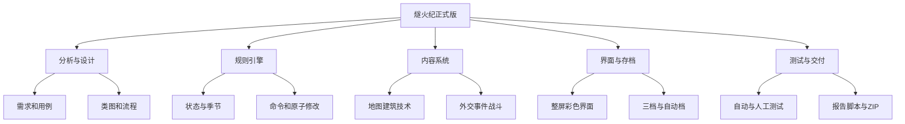
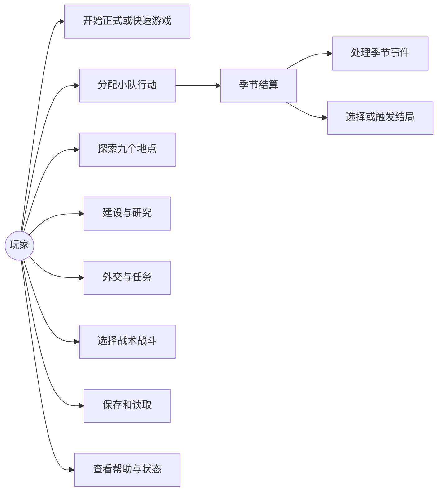

# 《燧火纪：部落黎明》正式版需求说明

## 1. 项目目标

开发一款单机文字策略 MUD。玩家不是单个英雄，而是燧火部落的共同意志，在四年十六个季节中分配小队、建设营地、研究技术、探索地图，并处理河鹿、白羽和岩牙三个部落的关系。

正式版必须同时满足：玩法可完整通关、中文界面友好、存档可靠、类的职责清楚、自动测试可重复，以及 Visual Studio 2026 和 macOS CMake 均可构建。

## 2. 用户与使用场景

- 第一次试玩的同学：使用数字快捷键和中文帮助完成一局。
- 熟悉 MUD 的玩家：使用中文或英文命令直接操作。
- 课程评审同学：在快速模式中展示探索、建设、外交、战斗、存档和结局。
- 开发组员：按地图、经营、外交战斗、界面存档、测试文档等模块协作。

## 3. 功能需求

### 3.1 游戏模式

- 正式模式：从第一年春季开始，共 16 季，每季最多 3 支小队行动。
- 快速模式：从第三年春季开始，共 8 季，使用经过平衡的中期初始状态。
- 两种模式使用相同规则、命令、存档格式和结局系统。

### 3.2 游戏世界

- 地图固定为 9 个相互连接的地点，开局只发现燧火营地、苍林、红土原。
- 玩家可侦察相邻地点，已发现地点决定资源、人物、任务与战斗地形。
- 河鹿、白羽、岩牙三个外部部落分别拥有关系值和两阶段任务。

### 3.3 经营与成长

- 状态包含人口、食物、木材、石料、草药、战士、士气、营地耐久和敌方战力。
- 每次合法行动只消耗一支小队；查询、帮助和失败命令不消耗。
- 玩家可以消耗3食物举行鼓舞活动，使士气提高8，避免低士气只能依赖随机事件恢复。
- 六种建筑只能各建一次，九项技术按生存、战争、外交三条路线逐级解锁。
- 每季结算食物，冬季消耗更高；人口减少会降低下一季可用小队数。

### 3.4 外交、事件与战斗

- 外交包含交谈、赠礼和完成任务，不允许只靠无限赠礼直接获得最终联盟。
- 事件由新游戏种子生成，同一种子产生相同的 16 季事件表。
- 战斗支持正面进攻、伏击、防守和撤退；结果由双方实力、士气、技术、地形和战术共同决定。
- 重大失败造成资源、人口、士气或营地耐久损失，但除覆灭外仍可继续补救。

### 3.5 结局

- 联盟共主、山河征服者、燧火繁荣、迁徙新生、部落覆灭共五种结局。
- 最后一季结束时，覆灭优先；存活时列出已满足的目标，由玩家选择结局，迁徙始终作为保底道路。
- 游戏结束后只能查询结果或返回主菜单，不能继续修改状态。

### 3.6 界面与命令

- 交互终端中每回合清屏重画标题、季节、资源、地图、最近消息和底部命令栏。
- 敌人红色、中立蓝色、盟友绿色；不同资源使用不同颜色。
- 不支持 ANSI 的终端或自动测试输出使用无颜色滚动模式。
- 所有主要行为支持数字快捷方式、中文命令和英文命令。

### 3.7 存档

- 三个手动存档位和一个自动存档位。
- 新游戏及每次进入新季后写入自动档。
- 加载必须先解析并校验临时状态，全部合法后才能替换当前游戏。
- 保存采用临时文件和备份替换，写入失败时尽量恢复旧档。

## 4. 非功能要求

- C++17、STL、CMake；不引入第三方库。
- MSVC 启用 `/W4 /permissive- /utf-8`，其他编译器启用 `-Wall -Wextra -Wpedantic`。
- 所有规则运算可重复，不依赖真实时间；真实时间仅用于生成新游戏种子。
- 业务操作先校验后提交，失败时保持状态原子性。
- 现有三个选题 Demo 的功能与 33 项测试不得回归。

## 5. WBS 工作分解结构

## 6. Use Case 用例图

## 7. 明确不做

- 鼠标窗口、联网、音效、真正魔法、实时战斗、逐个族人操作、大型科技树和自由脚本模组。
- 不把三个旧 Demo 合并进正式版规则，也不删除旧版代码和测试。
